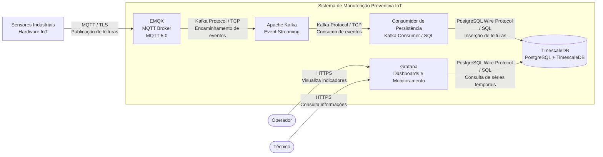

```mermaid

flowchart LR

    
    Operador(["Operador"])
    Tecnico(["Técnico"])
    Sensores["Sensores Industriais<br/>Hardware IoT"]

    
    subgraph IoT["Sistema de Manutenção Preventiva IoT"]

        EMQX["EMQX<br/>MQTT Broker<br/>MQTT 5.0"]

        Kafka["Apache Kafka<br/>Event Streaming"]

        Persistencia["Consumidor de Persistência<br/>Kafka Consumer / SQL"]

        Timescale[("TimescaleDB<br/>PostgreSQL + TimescaleDB")]

        Grafana["Grafana<br/>Dashboards e Monitoramento"]

    end

    
    Sensores -->|"MQTT / TLS<br/>Publicação de leituras"| EMQX

    Operador -->|"HTTPS<br/>Visualiza indicadores"| Grafana

    Tecnico -->|"HTTPS<br/>Consulta informações"| Grafana

    
    EMQX -->|"Kafka Protocol / TCP<br/>Encaminhamento de eventos"| Kafka

    Kafka -->|"Kafka Protocol / TCP<br/>Consumo de eventos"| Persistencia

    Persistencia -->|"PostgreSQL Wire Protocol / SQL<br/>Inserção de leituras"| Timescale

    Grafana -->|"PostgreSQL Wire Protocol / SQL<br/>Consulta de séries temporais"| Timescale


    class Operador,Tecnico person
    class Sensores external
    class EMQX,Kafka,Persistencia,Grafana container
    class Timescale database

```