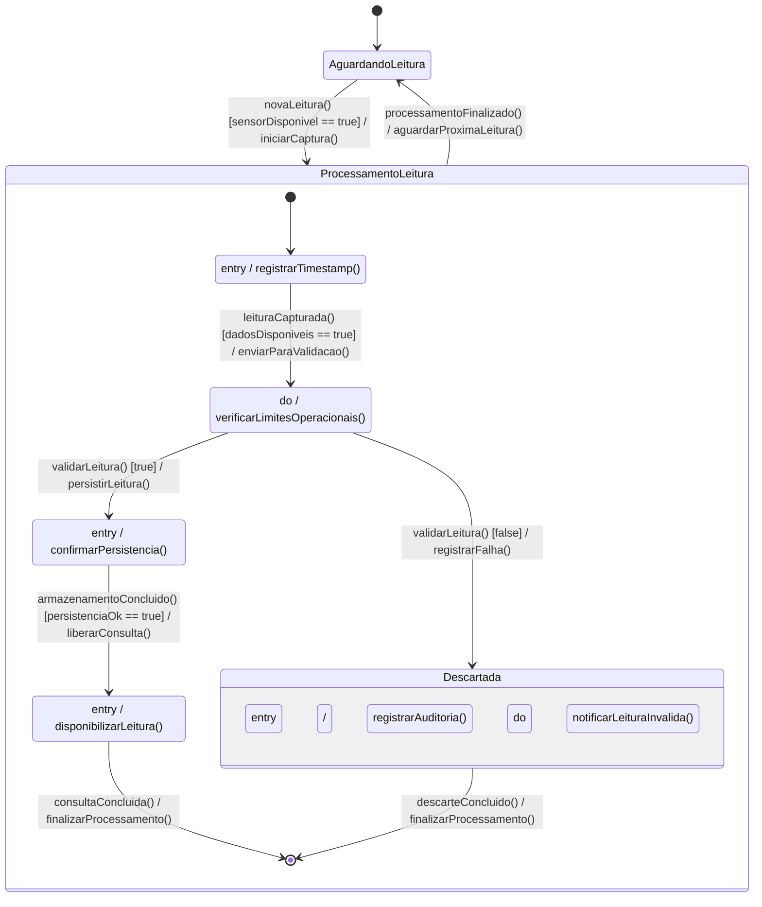

```mermaid


stateDiagram-v2

    [*] --> AguardandoLeitura

    AguardandoLeitura --> ProcessamentoLeitura : novaLeitura() [sensorDisponivel == true] / iniciarCaptura()

    state ProcessamentoLeitura {

        [*] --> LeituraCapturada

        LeituraCapturada : entry / registrarTimestamp()
        LeituraCapturada --> EmValidacao : leituraCapturada() [dadosDisponiveis == true] / enviarParaValidacao()

        EmValidacao : do / verificarLimitesOperacionais()

        EmValidacao --> Armazenada : validarLeitura() [true] / persistirLeitura()

        EmValidacao --> Descartada : validarLeitura() [false] / registrarFalha()

        state Descartada {
            entry / registrarAuditoria()
            do / notificarLeituraInvalida()
        }

        Armazenada : entry / confirmarPersistencia()
        Armazenada --> Disponibilizada : armazenamentoConcluido() [persistenciaOk == true] / liberarConsulta()

        Disponibilizada : entry / disponibilizarLeitura()
        
        Disponibilizada --> [*] : consultaConcluida() / finalizarProcessamento()

        Descartada --> [*] : descarteConcluido() / finalizarProcessamento()
    }

    ProcessamentoLeitura --> AguardandoLeitura : processamentoFinalizado() / aguardarProximaLeitura()

```