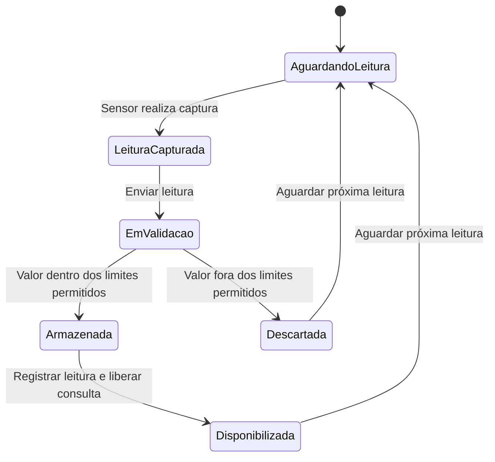

```mermaid

stateDiagram-v2

    [*] --> AguardandoLeitura

    AguardandoLeitura --> LeituraCapturada : Sensor realiza captura

    LeituraCapturada --> EmValidacao : Enviar leitura

    EmValidacao --> Armazenada : Valor dentro dos limites permitidos

    EmValidacao --> Descartada : Valor fora dos limites permitidos

    Armazenada --> Disponibilizada : Registrar leitura e liberar consulta

    Disponibilizada --> AguardandoLeitura : Aguardar próxima leitura

    Descartada --> AguardandoLeitura : Aguardar próxima leitura

```