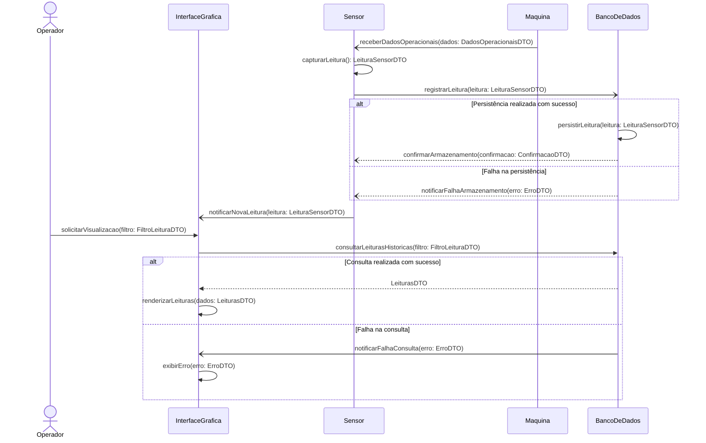

```mermaid
sequenceDiagram
    actor Operador
    participant GUI as InterfaceGrafica
    participant Sensor
    participant Maquina
    participant BD as BancoDeDados

    Maquina-)Sensor: receberDadosOperacionais(dados: DadosOperacionaisDTO)

    Sensor->>Sensor: capturarLeitura(): LeituraSensorDTO

    Sensor-)BD: registrarLeitura(leitura: LeituraSensorDTO)

    alt Persistência realizada com sucesso
        BD->>BD: persistirLeitura(leitura: LeituraSensorDTO)
        BD--)Sensor: confirmarArmazenamento(confirmacao: ConfirmacaoDTO)
    else Falha na persistência
        BD--)Sensor: notificarFalhaArmazenamento(erro: ErroDTO)
    end

    Sensor-)GUI: notificarNovaLeitura(leitura: LeituraSensorDTO)

    Operador->>GUI: solicitarVisualizacao(filtro: FiltroLeituraDTO)

    GUI->>BD: consultarLeiturasHistoricas(filtro: FiltroLeituraDTO)

    alt Consulta realizada com sucesso
        BD-->>GUI: LeiturasDTO
        GUI->>GUI: renderizarLeituras(dados: LeiturasDTO)
    else Falha na consulta
        BD-)GUI: notificarFalhaConsulta(erro: ErroDTO)
        GUI->>GUI: exibirErro(erro: ErroDTO)
    end

```