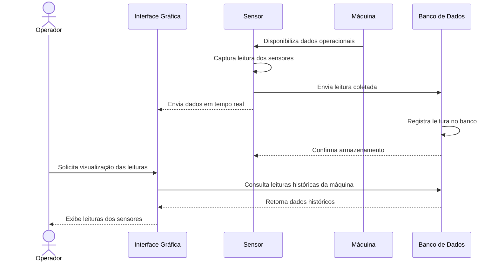

```mermaid
sequenceDiagram
    actor Operador
    participant GUI as Interface Gráfica
    participant Sensor
    participant Maquina as Máquina
    participant BD as Banco de Dados

    Maquina->>Sensor: Disponibiliza dados operacionais
    Sensor->>Sensor: Captura leitura dos sensores
    Sensor->>BD: Envia leitura coletada
    Sensor-->>GUI: Envia dados em tempo real
    BD->>BD: Registra leitura no banco
    BD-->>Sensor: Confirma armazenamento
    Operador->>GUI: Solicita visualização das leituras
    GUI->>BD: Consulta leituras históricas da máquina
    BD-->>GUI: Retorna dados históricos
    GUI-->>Operador: Exibe leituras dos sensores

```